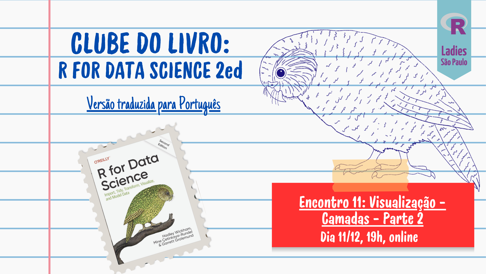

# Análise Exploratória de Dados

Este repositório contém os materiais referentes a apresentação do
Capítulo **Análise Exploratória de Dados** do livro [R para Ciência de
Dados](https://pt.r4ds.hadley.nz) no [Clube do livro da R-Ladies São
Paulo](https://github.com/R-Ladies-Sao-Paulo/2024-clube-do-livro-r4ds).

## Apresentação

| Data | Apresentação |
|----|----|
| **11/02/2025** |   |
| **11/03/2025** |   |

## Material

| \*\* | Tipo de Material | Link do Material | Link do Repositório |
|----|----|----|----|
| 👩🏻‍🏫 | Slide | <https://clube-do-livro-rladies-sp-eda.netlify.app/> | <https://github.com/arianacabral/clube-do-livro-rladies-sp-eda> |
| 📝 | Resolução dos exercícios | <https://pt-r4ds-solutions.netlify.app> | <https://github.com/arianacabral/pt-r4ds-solutions> |
| 💻 | Script | <https://github.com/arianacabral/clube-do-livro-rladies-sp-eda/blob/main/R/cap10-eda.R> | <https://github.com/arianacabral/clube-do-livro-rladies-sp-eda> |
